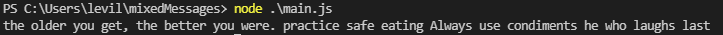

# Drunken Fortunes

> Generates a random fortune

## General Information

- Will return a random fortune of three different fortunes
- Could be a fortune of good luck or just another rambling drunk
- It's up to you to decide if the drunk fortune is good advice
- This project is to show my skills of JavaScript and Git

## Technologies Used

- node.js v16.13.1

## Screenshots

## Usage

Load the script into a file containing a main.js
then run the command using node.js

`node main.js`

## Project Status

Project is: _complete_

## Room for Improvement

Room for improvement:

- Add more fortunes
- Classify what type of fortune it is e.g. Money/Fame/Luck

## Contact

Created by [@1ong1evi] - feel free to contact me!

<!-- Thank you to @ritaly for the README template -->
